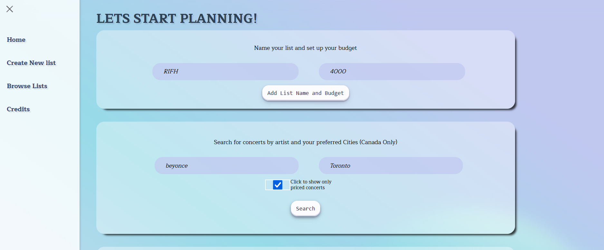
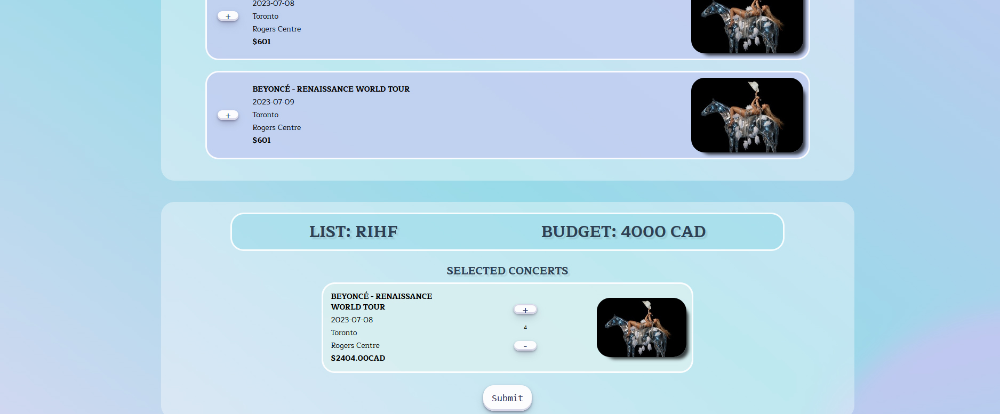
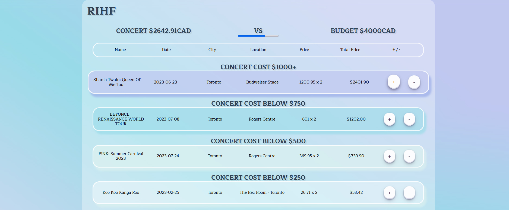
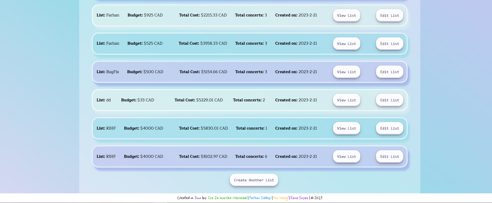

# Concert Budget Master (Group Project)

## Live Link 
https://concert-budget-masters.netlify.app/

## Description
Concert Budget Master is a web app that allows users to compare their budget and cost of conert, 
allow user to seacrh data from api data and store their list in to fire base!

## Installation

To install and run the app locally, follow these steps:

1. Clone the repository to your local machine.
2. Navigate to the root directory of the project in your terminal.
3. Run `npm install` to install the app's dependencies.
4. Create a new Firebase project and configure the app to use your Firebase project credentials.
5. Run `npm start` to start the app in development mode.

## Usage

To use the app, follow these steps:

1. Visit the app's home page and create list
2. Create new list  for your budget by add button

3. search your desired concert
4. review your selcetion before updating 

5. edit the item inside after pubish

6. compare your list to the others 

## Contributing

If you would like to contribute to the project, please follow these steps:

1. Fork the repository to your own GitHub account.
2. Clone the repository to your local machine.
3. Create a new branch for your changes and make your changes on that branch.
4. Push your changes to your forked repository.
5. Submit a pull request to the main repository and await review.

## Credits

Budget Tracker was created by [Your Name Here](https://your-website.com/). Special thanks to [Some Other Person](https://their-website.com/) for their help with data visualization.

## License

Budget Tracker is licensed under the [MIT License](https://opensource.org/licenses/MIT).